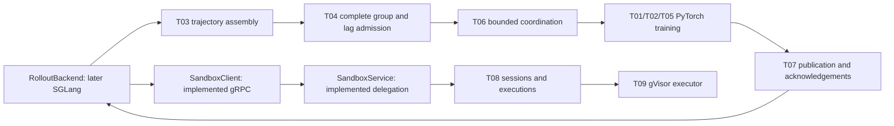

# Architecture and ownership

Implemented support: strict YAML config and CLI, immutable records and JSON codec,
JSONL sink, protobuf schema/generated bindings, gRPC client/server, deterministic
fixtures, smoke harness and checks. Fixture behavior: static transcript responses and
fully authored trajectory records in `lagrl.testing`. Unimplemented production behavior:
T01–T10. The smoke harness never calls or substitutes for their algorithms.

This diagram describes the eventual runtime, not an implemented scheduler. For smoke,
the service delegates directly to static `RecordedSandbox` fixture lookup. Production
CLI service construction delegates to `SessionManager` and `GVisorExecutor` instead.
An unfinished handler returns UNIMPLEMENTED; no fake is selected automatically.

Modules are deliberately focused: `contracts`, `rollout`, `training`, `coordination`,
`publication`, `variance`, `sandbox`, `observability`. Protocols expose only required
boundaries. Ray Core may later place these workers in processes on one node. PyTorch
NCCL may later transfer snapshots to GPU rollout workers; there is no custom collective
or multi-node deployment. No Kubernetes, autoscaling, dashboard or plugin registry.

The caller owns server/channel/backend lifetimes. The transport context owns only its
gRPC server. The smoke harness explicitly owns and closes its fixture backend. T06 owns
its spawned worker tasks; T08 owns accepted executions until terminal status or session
cleanup. The learner must implement those ownership and cancellation transitions.

Training never rewrites sampling evidence. Rollout records hold sampled log-probabilities
and the policy version per action span; optimizer references live in `TrainingBatch`.
Admission treats a complete group as the unit. Whole-group failure/rejection remains
observable; the fastest subset never becomes a smaller group. Logs must retain IDs and
versions when real paths are added; record metadata rather than arbitrary command contents.

Tests assert small observable invariants without implementing the missing algorithms.
Lifecycle tests may inject a scripted executor and controlled clock into the **actual**
manager; the executor does no lifecycle, admission or deduplication itself.
